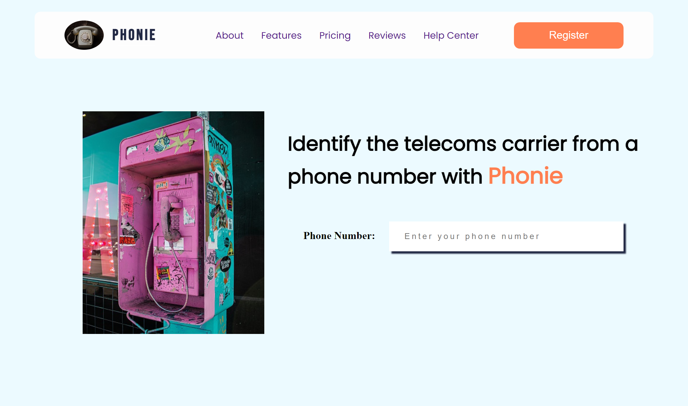

# Phonie

Phonie is a simple web application that identifies the phone service provider of any MTN, Airtel, Glo, or 9Mobile mobile phone number.

Don't want to type in the full phone number? Just type in the first four digits of the number (eg 0703... ) or the country code and the first three digits of the number ( eg +234703... ) and get an immediate response without having to click a button.

## Preview

## Group members

* [Adebolu Ayodeji](https://github.com/Adeyod)
* [Oreoluwa Ruth Ajayi](https://github.com/oreoluwa212)
* [Okoroafor Wisdom Onyinye]()
* [Petra Ojamanhor](https://github.com/Petra-Cae)
* [Nnenna Onwuka](https://github.com/Nne1509)
* [Doreen Iyere Enebi](https://github.com/Deetechdiva)
* [Abubakar Umar](https://github.com/abksidiq)

